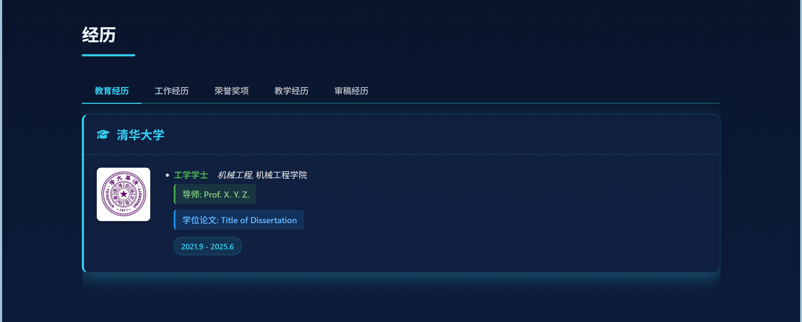
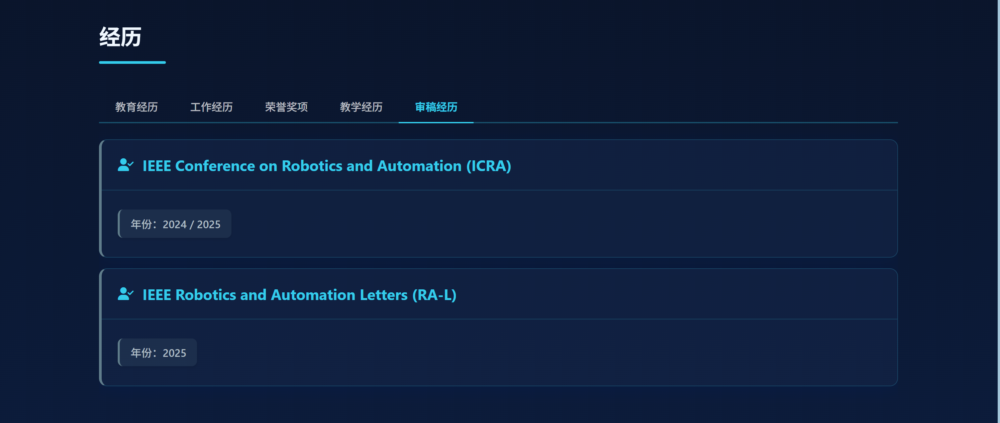
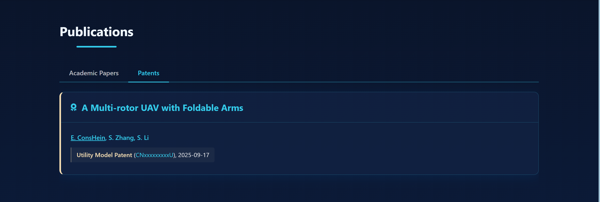
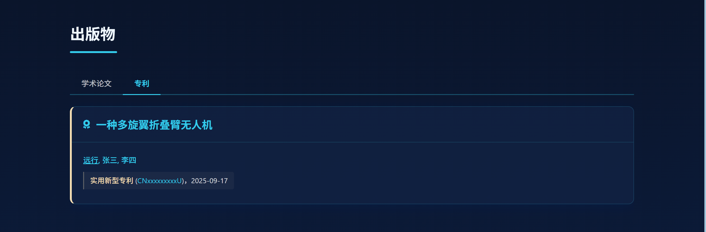
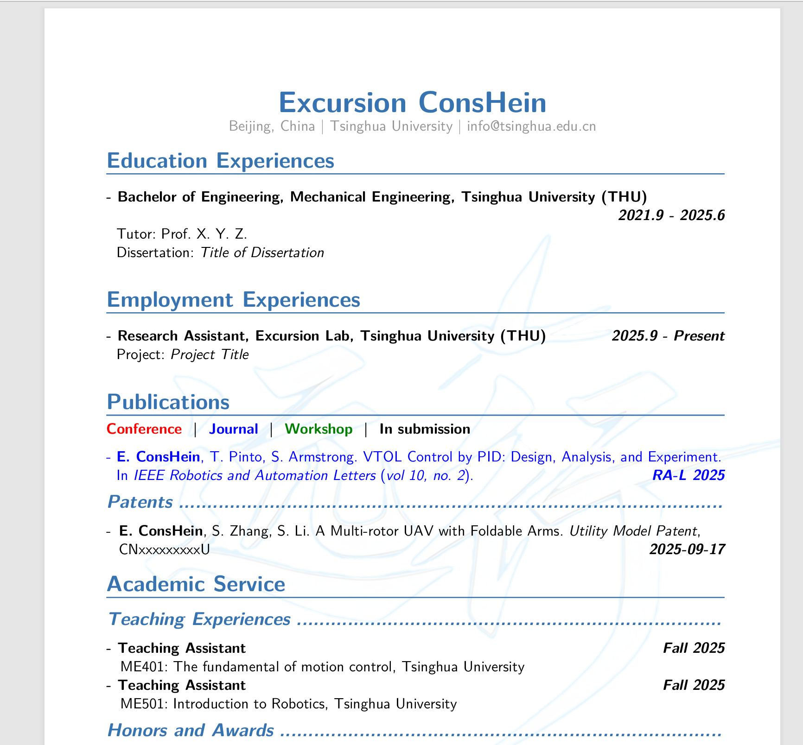

# Excursion ConsHein Homepage Personal Homepage Creation Tutorial

English Version | [中文版](README_zh.md)

This project is a clean and concise personal homepage template, suitable for **personal academic showcase**, **job application showcase**, etc.

This tutorial teaches you how to fork this project and add your own information to create your own personal homepage.

**Disclaimer: This project template is for research and learning purposes only and does not involve any commercial use.**

**If you use this project template to create a personal homepage, you must ensure compliance with relevant laws and regulations and not use it for any commercial activities.**

You can try this homepage via the link: [Excursion Conshein Homepage](https://excursion-conshein.github.io/excursion-conshein-homepage/)

---

Update: 2025-09-18

## Excursion ConsHein Homepage 2.0 Update 1 Released, with Light and Dark Mode Switching Function!


---
Update: 2025-09-17

## Excursion ConsHein Homepage 2.0, is officially online!

This 2.0 version of the homepage template brings more innovations and optimizations!

### 1. UI overhaul, cool and techy, with more practical features!


### 2. Added Chinese-English switching function, you can switch the homepage language version anytime, anywhere!


### 3. Added Excursion ConsHein and "Excursion Pigeon" logos in the top left corner


**In addition, there are more content updates below!**

**Excursion ConsHein Homepage 2.0, waiting for you to experience!**

(Note: The old version of the personal homepage template is stored in `src/index_origin.html`)

---

## 1. Project Introduction

This project is a personal homepage template based on HTML and JavaScript, with the following features:
- Simple and beautiful interface design
- Content management based on configuration files
- **Customizable without programming experience!**
- Supports displaying personal information, experiences, honors, publications, etc.

The homepage supports both landscape and portrait dual-end experience. After the 2.0 update, **the dual-end design is more intuitive!**

- The desktop experience is smoother, with very smooth page transitions


- The mobile end is more modular, preventing the information bar from dominating the page and improving navigation


## 2. How to Start

### Step 1: Fork the Repository

1. Visit the [Excursion-ConsHein.github.io](https://github.com/Excursion-ConsHein/Excursion-ConsHein.github.io) repository
2. Click the "Fork" button in the upper right corner to copy the repository to your GitHub account
3. Clone the forked repository to your local machine:
   ```bash
   git clone https://github.com/{your-username}/{your-repo-name}.git
   ```
   Here, {your-username} is your GitHub username, and {your-repo-name} is the name of your forked repository.

   Note, for your personal or organization repository, the format of {your-repo-name} is:
   ```bash
   {your-username}.github.io
   ```
   Each person or organization can have only one Github Pages in this form.

   For example, my username is Excursion-ConsHein, and the repo name is Excursion-ConsHein.github.io, then I should run:
   ```bash
   git clone https://github.com/ConsHein/Excursion-ConsHein.github.io.git
   ```
   This will clone the repository into the local `Excursion-ConsHein.github.io` directory.

   Of course, you can name the repository differently, but then your page url becomes:
   ```bash
   {your-username}.github.io/{your-repo-name}
   ```
   Accordingly, your clone command becomes:
   ```bash
   git clone https://github.com/{your-username}.github.io/{your-repo-name}.git
   ```
   You can have as many such pages as you want, with no quantity limit.

### Step 2: Directory Structure

The project directory structure is as follows:
```
├── index.html               # Main page
├── README.md                # English documentation (this document)
├── README_zh.md             # Chinese documentation
├── components/              # Third-party components
│   ├── all_min.css          # Minified CSS file
│   ├── chart.js             # Chart library
│   ├── fa-solid-900.ttf     # Font Awesome font
│   └── fa-solid-900.woff2   # Font Awesome font (WOFF2 format)
├── configs/                 # Configuration files
|   ├── config.json          # Language mode settings
│   ├── en/                  # English configuration
│   │   ├── cv.pdf           # English CV
│   │   ├── education.json   # Education configuration
│   │   ├── employment.json  # Employment configuration
│   │   ├── honors.json      # Honors configuration
│   │   ├── info.json        # Basic info configuration
│   │   ├── intro.txt        # Self introduction
│   │   ├── news.json        # News configuration
│   │   ├── papers.json      # Publications configuration
│   │   ├── patents.json     # Patents configuration
│   │   ├── reviewer.json    # Reviewer configuration
│   │   └── teaching.json    # Teaching configuration
│   └── zh/                  # Chinese configuration (all corresponding Chinese configs below)
│       ├── cv_zh.pdf
│       ├── education_zh.json
│       ├── employment_zh.json
│       ├── honors_zh.json
│       ├── info_zh.json
│       ├── intro_zh.txt
│       ├── news_zh.json
│       ├── papers_zh.json
│       ├── patents_zh.json
│       ├── reviewer_zh.json
│       └── teaching_zh.json
├── images/                  # Image resources
│   ├── experience/          # Experience images
│   ├── homepage/            # Homepage images
│   │   ├── favicon/         # Website icons
│   │   ├── info icon/       # Info icons
│   │   └── photo/           # Personal photo
│   └── publication/         # Publication images
└── src/                     # Source code
    ├── base.css             # Base styles
    ├── cacheclearing.js     # Cache clearing
    ├── cv_generator.js      # CV generator
    ├── cv.js                # CV related
    ├── distribution.js      # Page distribution
    ├── experiences.js       # Experience display
    ├── home.js              # Homepage logic
    ├── language.js          # Language switching
    ├── mobile.css           # Mobile styles
    ├── module-container.js  # Module container
    ├── nav.js               # Navigation logic
    ├── light.css            # Light theme styles
    ├── theme.js             # Theme management
    └── publications.js      # Publications display
```

## 3. Language Configuration

This project supports single-language or bilingual mode. By modifying the `configs/config.json` file, you can choose to use only Chinese, only English, or keep bilingual support:

```json
{
    "availableLanguages": ["en", "zh"],  // Available languages
    "defaultLanguage": "en",             // Default language
    "singleLanguageMode": false           // Whether to enable single language mode
}
```

### Configuration Instructions:

1. **Bilingual Mode** (default):
```json
{
    "availableLanguages": ["en", "zh"],
    "defaultLanguage": "en",
    "singleLanguageMode": false
}
```
- You need to maintain all files under both `configs/en/` and `configs/zh/` directories
- Users can switch languages at any time using the language switch button

2. **English Only**:
```json
{
    "availableLanguages": ["en"],
    "defaultLanguage": "en",
    "singleLanguageMode": true
}
```
- Only need to maintain files under `configs/en/`
- The language switch button will be hidden automatically

3. **Chinese Only**:
```json
{
    "availableLanguages": ["zh"],
    "defaultLanguage": "zh",
    "singleLanguageMode": true
}
```
- Only need to maintain files under `configs/zh/`
- The language switch button will be hidden automatically

## 4. Customize Your Information

**Note: All example content below is for demonstration only and does not represent real information!**

### Edit Personal Information

Personal information is on the left side of the home section.

Edit `configs/en/info.json` and/or `configs/zh/info_zh.json` to add your personal information:
```json
{
  "name": "Your Name",
  "address": "Your Address",
  "institution": "Your Institution",
  "google scholar": "Your Google Scholar Link",
  "github": "Your GitHub Link",
  "email": "Your Email",
  "UTC": "Your timezone, eg. +8, default is +8",
}
```


### Add Educational Experience

Educational experience is in the first column of the experiences section.

Edit `configs/en/education.json` and/or `configs/zh/education_zh.json` to add your educational experience:
```json
[
    {
        "logoSrc": "Logo of the institution, stored in images/experience/",
        "school": "School Name",
        "details": [
            {
                "degree": "Degree",
                "major": "Major",
                "college": "College",
                "time": "Time"
            }
            // If you have multiple experiences at the same institution, add more here...
        ],
        "link": "School Link"
    }
    // Add more institutions here if needed...
]
```




### Add Employment Experience

Employment experience is in the second column of the experiences section.

Edit `configs/en/employment.json` and/or `configs/zh/employment_zh.json` to add your employment experience:
```json
[
    {
        "logoSrc": "Logo of the company, stored in images/experience/",
        "company": "Company Name",
        "details": [
            {
                "position": "Position",
                "time": "Time"
            }
            // If you have multiple positions at the same company, add more here...
        ],
        "link": "Company Link"
    }
    // Add more companies here if needed...
]
```


### Add Honors and Awards

Honors and awards are in the third column of experiences. If you have no honors or awards, leave the document empty or delete it, and the section will be hidden.

Edit `configs/en/honors.json` and/or `configs/zh/honors_zh.json`:
```json
[
    {
        "time": "Year Awarded",
        "award": "Award Name",
        "unit": "Awarding Organization"
    }
    // Add more honors and awards here if needed...
]
```


### Add Teaching Experience

Teaching experience is in the fourth column of experiences. If you have no teaching experience, leave the document empty or delete it, and the section will be hidden.

Edit `configs/en/teaching.json` and/or `configs/zh/teaching_zh.json`:
```json
[
    {
        "school": "School Name",
        "course": "Course Name",
        "code": "Course Code",
        "identity": "Role, eg. TA/Lecturer",
        "season": "Semester, eg. Fall/Spring",
        "year": "Year",
        "link": "Course Link, delete if not available"
    }
    // Add more teaching experiences here if needed...
]
```


### Add Reviewing Experience

Reviewing experience is in the fifth column of experiences. If you have no reviewing experience, leave the document empty or delete it, and the section will be hidden.

Edit `configs/en/reviewer.json` and/or `configs/zh/reviewer_zh.json`:
```json
[
    {
        "conference": "Conference Name",
        // If the review is for a journal, use "journal": "Journal Name"
        "year": "Year of Review"
    }
    // Add more reviewing experiences here if needed...
]
```




### Add Academic Publications

Academic publications are in the first column of the publications section.

Edit `configs/en/papers.json` and/or `configs/zh/papers_zh.json`:
```json
{
  "Year": [
    {
      "title": "Paper Title",
      "authors": "Authors List",
      "type": "Type, Conference/Journal/In Submission/Workshop",
      "conference": "Conference Name",
      // For journals, use "journal": "Journal Name"
      "image": "Paper image, stored in images/publication/",
      "paperLink": "Paper Link",
      "codeLink": "Code Repository Link, delete if not available",
      "videoLink": "Embedded Video Link, delete if not available",
      "siteLink": "Custom Project Page Link, delete if not available"
    }
    // Add more papers for this year here if needed...
  ]
  // Add more years here if needed...
}
```


### Add Patents

Patents are in the second column of the publications section. If you have no patents, leave the document empty or delete it, and the section will be hidden.

Edit `configs/en/patents.json` and/or `configs/zh/patents_zh.json`:
```json
{
  "patents": [
    {
        "type": "Patent Type",
        "title": "Patent Title",
        "authors": "Authors List",
        "number": "Patent Number",
        "date": "Grant Date",
        "link": "Patent Link"
    }
    // Add more patents here if needed...
  ]
}
```





### Add Latest News

Latest news is in the second column on the right side of the home section.

Edit `configs/en/news.json` and/or `configs/zh/news_zh.json`:
```json
{
  "news": [
    {
        "time": "Date, eg. 2023-01-01",
        "content": "News Content"
    }
    // Add more news here if needed...
  ]
}
```


### Add CV

The CV is displayed in the cv section as a PDF Viewer.

Name your CV PDF file as `cv.pdf` (English version) and/or `cv_zh.pdf` (Chinese version), and replace `configs/en/cv.pdf` and/or `configs/zh/cv_zh.pdf`.




### Add Personal Introduction

Personal introduction is in the first column on the right side of the home section.

Edit `configs/en/intro.txt` and/or `configs/zh/intro_zh.txt` to add your personal introduction text.


## 5. Add Images

### Personal Photo

Personal photo is at the top of the left info bar in the home section.

Replace `images/homepage/photo/photo.png` with your own photo.

### Info Icons

Info icons are used as type identifiers in the left info bar of the home section.

You can replace the images in `images/homepage/info icon/` to customize the info icons.

### Clean Up Resources

You can delete the `images/preview` folder and clear the two README.md files to reduce the file size for submission and prevent push blocking.

## 6. Preview and Deploy

### Local Preview

1. Open the `index.html` file on your local computer to preview your personal homepage
2. For advanced preview, you can use a local server, such as Python's simple HTTP server:
   ```bash
   cd your-repo-directory
   python -m http.server
   ```
3. Then visit `http://localhost:8000` in your browser

### Deploy to GitHub Pages

1. Make sure your repository name is in the format `your-username.github.io`
2. Commit and push all changes to GitHub:
   ```bash
   git add .
   git commit -m "Update personal info"
   git push origin main
   ```
3. Wait a few minutes, then visit `https://your-username.github.io` to view your personal homepage

## 7. FAQ

### Q: Do I need to know programming?
A: No. You just need to follow this tutorial to modify configuration files and add images.

### Q: How do I customize the page style?
A: If you have HTML/CSS basics, you can modify the styles in the `index.html` file.

### Q: When will my homepage update?
A: After you push changes to GitHub, it usually updates within a few minutes.

## 8. Contact Us

If you encounter problems during use, you can contact us by:
- Email: Conshein_Yuanxing@outlook.com
- GitHub: [Excursion-ConsHein](https://github.com/Excursion-ConsHein)

I hope you can freely build your own personal homepage with **Excursion ConsHein Homepage**!
