# Excursion ConsHein Homepage 个人主页创建教程

[English Version](README.md) | [中文版](README_zh.md)

本项目是一个清晰简洁的个人主页模板，可用于**个人学术展示**、**求职展示**等，

通过本教程教你如何 fork 该项目并添加自己的信息，打造属于你自己的个人主页。

**免责声明：本项目模板仅用于研究和学习目的，不涉及任何商业用途。**

**如果您使用本项目模板创建个人主页，您需要确保遵守相关法律法规，不得用于任何商业活动。**

可以通过链接尝试本主页：[Excursion Conshein Homepage](https://excursion-conshein.github.io/excursion-conshein-homepage/)

--- 

Update: 2025-09-18

## Excursion ConsHein Homepage 2.0 Update 1 发布，推出新的明暗切换功能！


---

Update: 2025-09-17

## 全新的 Excursion ConsHein Homepage 2.0 版本正式上线！

本次 2.0 版本的主页模板，带来了更多的革新和优化内容！

### 1. UI 大焕新，酷炫中带有科技感，以及更加好用的功能！

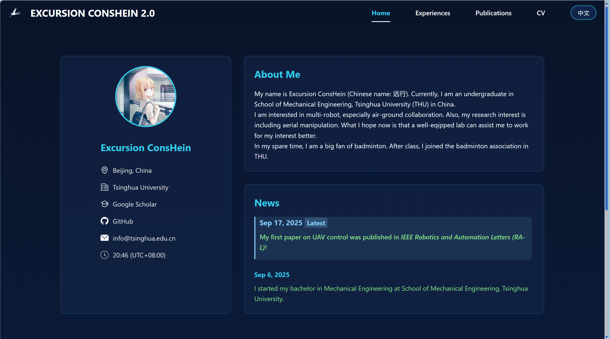

### 2. 新增中英文切换功能，可以随时随地切换对应语言版本的主页！


### 3. 左上角增设 Excursion ConsHein 以及“远行鸽”的logo


**除此之外，还有更多内容更新，尽在下文！**

**Excursion ConsHein Homepage 2.0，等你体验！**

（注：旧版本的个人主页模板已存放在 `src/index_origin.html` 中）

---

## 1. 项目介绍

本项目是一个基于 HTML 和 JavaScript 的个人主页模板，具有以下特点：
- 简洁美观的界面设计
- 基于配置文件的内容管理
- **无需编程经验即可自定义！**
- 支持展示个人信息、经历、荣誉、论文等内容

本项目主页支持横竖屏双端体验，在 2.0 版本更新后，**双端体感设计更加贴近感官反应！**

- 电脑端的体验更为流畅，页面切换相当丝滑


- 移动端也更有模块感，防止信息栏独占页面，造成导视效果欠佳

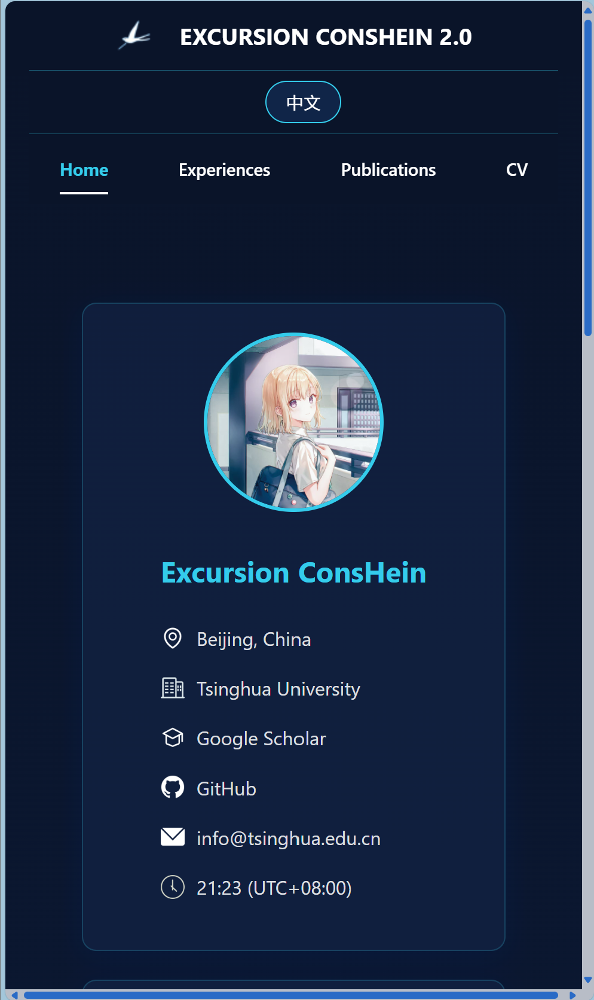

## 2. 如何开始

### 步骤 1: Fork 仓库

1. 访问 [Excursion-ConsHein.github.io](https://github.com/Excursion-ConsHein/Excursion-ConsHein.github.io) 仓库
2. 点击右上角的 "Fork" 按钮，将仓库复制到你的 GitHub 账户
3. 将 fork 后的仓库克隆到本地：
   ```bash
   git clone https://github.com/{你的用户名}/{你的仓库名}.git
   ```
   其中，{你的用户名} 是你的 GitHub 用户名，{你的仓库名} 是你 fork 后的仓库名。
   
   注意，对于自己个人或者组织的仓库而言，{你的仓库名}的格式为：
   ```bash
   {你的用户名}.github.io
   ```
   每一个人或组织，有且仅有一份 Github Pages 是以这种形式的。
   
   例如，我的用户名是 Excursion-ConsHein，仓库名是 Excursion-ConsHein.github.io，那么我应该执行：
   ```bash
   git clone https://github.com/ConsHein/Excursion-ConsHein.github.io.git
   ```
   这将把仓库克隆到本地的 `Excursion-ConsHein.github.io` 目录中。

   当然，你也可以不使用自己的用户名来命名仓库，不过此时你的页面url就变成：
   ```bash
   {你的用户名}.github.io/{你的仓库名}
   ```
   相应的，你要克隆的命令就变成了：
   ```bash
   git clone https://github.com/{你的用户名}.github.io/{你的仓库名}.git
   ```
   这样的页面，你可以做很多个，没有数量限制。

### 步骤 2: 目录结构

项目的目录结构如下：
```
├── index.html               # 主页面
├── README.md                # 英文说明文档
├── README_zh.md             # 中文说明文档（本文档）
├── components/              # 第三方组件
│   ├── all_min.css          # 压缩的CSS文件
│   ├── chart.js             # 图表库
│   ├── fa-solid-900.ttf     # Font Awesome字体
│   └── fa-solid-900.woff2   # Font Awesome字体(WOFF2格式)
├── configs/                 # 配置文件目录
|   ├── config.json          # 语言模式设置
│   ├── en/                  # 英文配置
│   │   ├── cv.pdf           # 英文简历
│   │   ├── education.json   # 教育经历配置
│   │   ├── employment.json  # 工作经历配置
│   │   ├── honors.json      # 荣誉配置
│   │   ├── info.json        # 基本信息配置
│   │   ├── intro.txt        # 自我介绍
│   │   ├── news.json        # 新闻配置
│   │   ├── papers.json      # 论文配置
│   │   ├── patents.json     # 专利配置
│   │   ├── reviewer.json    # 审稿人配置
│   │   └── teaching.json    # 教学配置
│   └── zh/                  # 中文配置（以下均为对应的中文配置）
│       ├── cv_zh.pdf
│       ├── education_zh.json
│       ├── employment_zh.json
│       ├── honors_zh.json
│       ├── info_zh.json
│       ├── intro_zh.txt
│       ├── news_zh.json
│       ├── papers_zh.json
│       ├── patents_zh.json
│       ├── reviewer_zh.json
│       └── teaching_zh.json
├── images/                  # 图片资源目录
│   ├── experience/          # 经历相关图片
│   ├── homepage/            # 主页图片
│   │   ├── favicon/         # 网站图标
│   │   ├── info icon/       # 信息图标
│   │   └── photo/           # 个人照片
│   └── publication/         # 出版物相关图片
└── src/                     # 源代码目录
    ├── base.css             # 基础样式
    ├── cacheclearing.js     # 缓存清理
    ├── cv_generator.js      # CV 生成器
    ├── cv.js                # 简历相关
    ├── distribution.js      # 页面分布相关
    ├── experiences.js       # 经历展示
    ├── home.js              # 主页逻辑
    ├── language.js          # 语言切换
    ├── mobile.css           # 移动端样式
    ├── module-container.js  # 模块容器
    ├── nav.js               # 导航逻辑
    ├── light.css            # 亮色主题样式
    ├── theme.js             # 主题管理
    └── publications.js      # 出版物展示
```

## 3. 配置语言设置

本项目支持配置单语言或双语模式。通过修改 `configs/config.json` 文件，你可以选择只使用中文、只使用英文，或者保持双语支持：

```json
{
    "availableLanguages": ["en", "zh"],  // 可用的语言
    "defaultLanguage": "en",             // 默认语言
    "singleLanguageMode": false          // 是否启用单语言模式
}
```

### 配置说明：

1. **双语模式**（默认）：
```json
{
    "availableLanguages": ["en", "zh"],
    "defaultLanguage": "en",
    "singleLanguageMode": false
}
```
- 需要维护 `configs/en/` 和 `configs/zh/` 两个目录下的所有文件
- 用户可以通过语言切换按钮随时切换语言

2. **仅使用英文**：
```json
{
    "availableLanguages": ["en"],
    "defaultLanguage": "en",
    "singleLanguageMode": true
}
```
- 只需要维护 `configs/en/` 目录下的文件
- 语言切换按钮会自动隐藏

3. **仅使用中文**：
```json
{
    "availableLanguages": ["zh"],
    "defaultLanguage": "zh",
    "singleLanguageMode": true
}
```
- 只需要维护 `configs/zh/` 目录下的文件
- 语言切换按钮会自动隐藏

## 4. 自定义你的信息

**注意：以下所有的图例内容仅为演示功能使用，不代表真实信息！**

### 修改个人基本信息

个人信息位于 home 部分的左侧。

编辑 `configs/en/info.json` 以及（或）`configs/zh/info_zh.json` 文件，添加你的个人信息：
```json
{
  "name": "你的姓名",
  "address": "你的地址",
  "institution": "你的机构",
  "google scholar": "你的 Google Scholar 链接",
  "github": "你的 GitHub 链接",
  "email": "你的邮箱",
  "UTC": "你的时区， eg. +8，默认设置为+8",
}
```

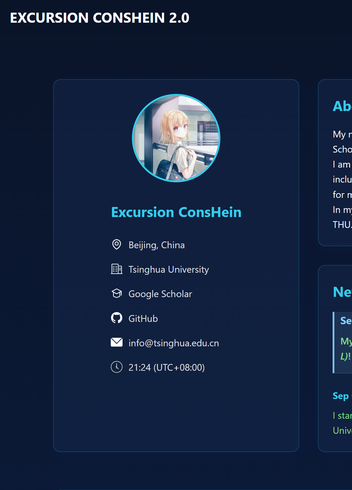

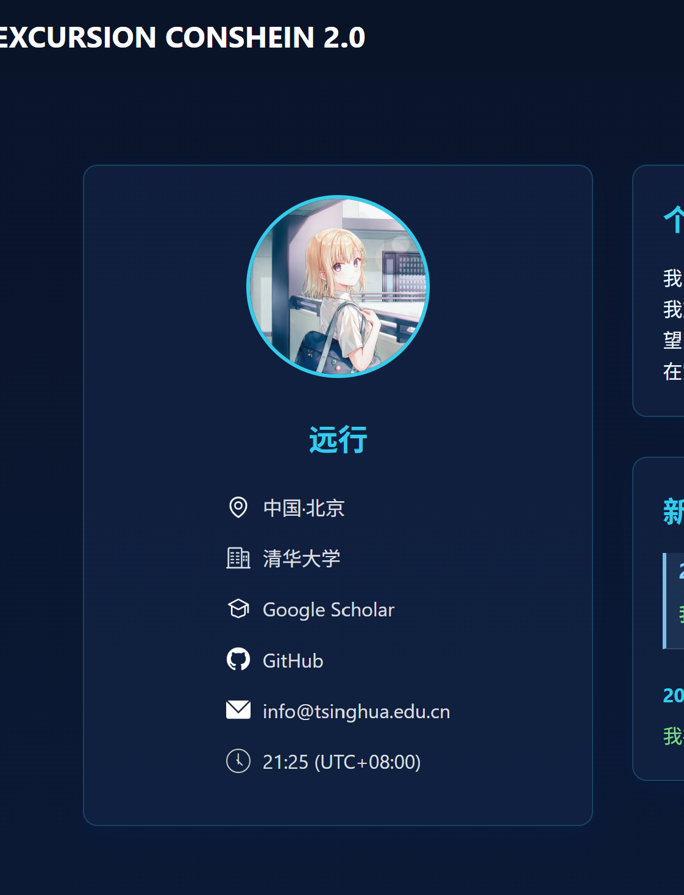

### 添加教育经历

教育经历位于 experiences 部分的第一个分栏中。

编辑 `configs/en/education.json` 以及（或）`configs/zh/education_zh.json` 文件，添加你的教育经历：
```json
[
    {
        "logoSrc": "所在学校单位的logo图，存放在images/experience/目录下",
        "school": "学校名称",
        "details": [
            {
                "degree": "学位",
                "major": "专业",
                "college": "学院",
                "time": "时间"
            },
            // 如果你在同一个学校具有多段不同的经历，可以在此继续添加...
        ],
        "link": "学校链接"
    },
    // 如果你在其他学校具有经历，可以在此继续添加...
]
```


### 添加工作经历

工作经历位于 experiences 部分的第二个分栏中。如果没有工作经历相关的信息，那就将文档空置，或者删除文档，对应的栏目将会隐藏。

编辑 `configs/en/employment.json` 以及（或）`configs/zh/employment_zh.json` 文件，添加你的工作经历：
```json
[
    {
        "logoSrc": "工作单位的logo图，存放在images/experience/目录下",
        "company": "公司名称",
        "details": [
            {
                "position": "职务",
                "department": "部门",
                "time": "时间"
            },
            // 如果你在同一个公司具有多段不同的经历，可以在此继续添加...
        ],
        "link": "公司链接"
    },
    // 如果你在其他公司具有经历，可以在此继续添加...
]
```

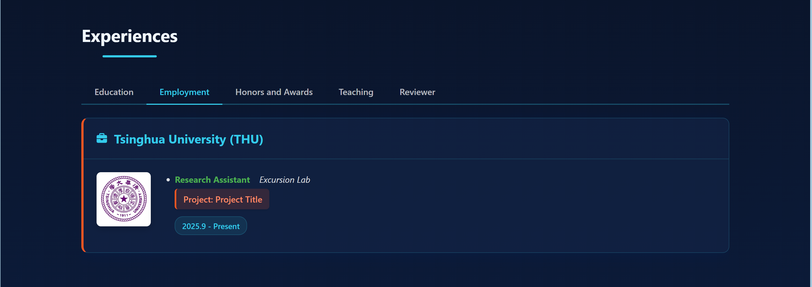

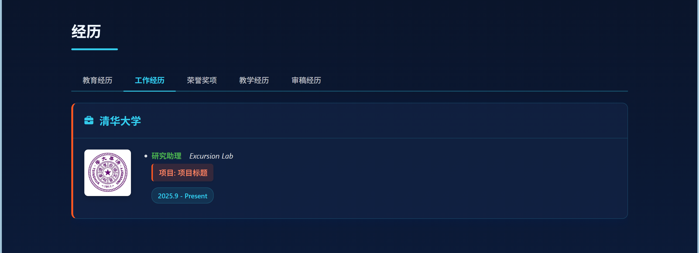

### 添加荣誉和奖项

荣誉和奖项位于 experiences 的第三个分栏中。如果没有荣誉和奖项相关的信息，那就将文档空置，或者删除文档，对应的栏目将会隐藏。

编辑 `configs/en/honors.json` 以及（或）`configs/zh/honors_zh.json` 文件：
```json
[
    {
        "time": "获奖年份",
        "award": "获奖名称",
        "unit": "颁奖单位"
    },
    // 如果你具有多项荣誉和奖项，可以在此继续添加...
]
```

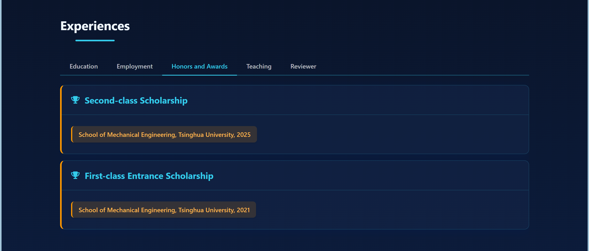

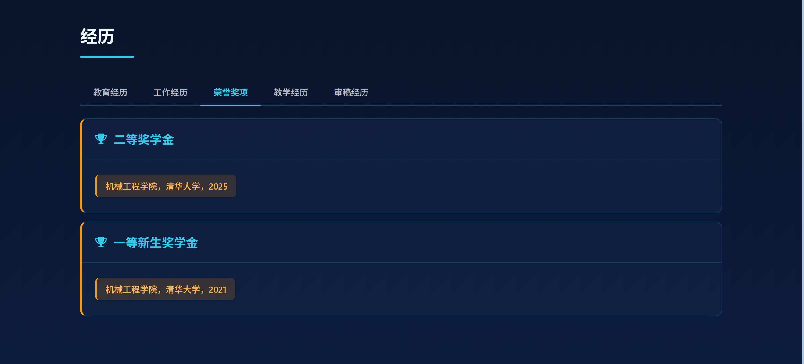

### 添加教学经历

教学经历位于 experiences 部分的第四个分栏中。如果没有教学经历相关的信息，那就将文档空置，或者删除文档，对应的栏目将会隐藏。

编辑 `configs/en/teaching.json` 以及（或）`configs/zh/teaching_zh.json` 文件：
```json
[
    {
        "school": "学校名称",
        "course": "课程名称",
        "code": "课程代码",
        "identity": "身份，eg. 助教/讲师",
        "season": "学期，eg. 秋季/春季",
        "year": "年份",
        "link": "课程链接，如果没有链接，可以将其删除"
    },
    // 如果你具有多项教学经历，可以在此继续添加...
]
```

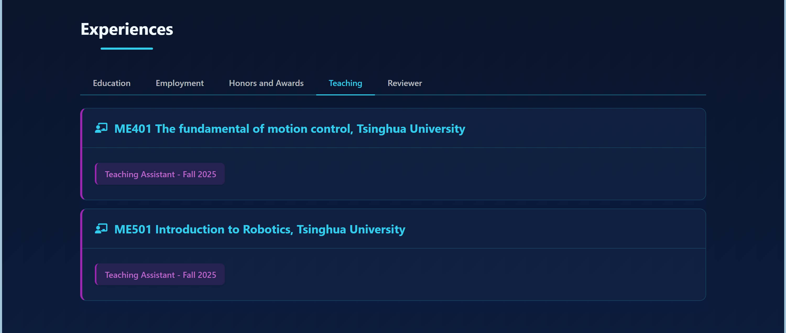

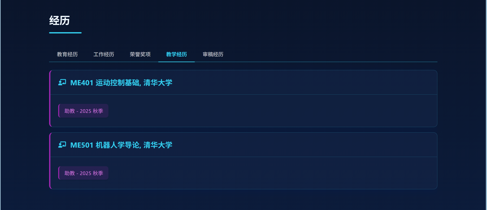

### 添加审稿经历

审稿经历位于 experiences 部分的第五个分栏中。如果没有审稿经历相关的信息，那就将文档空置，或者删除文档，对应的栏目将会隐藏。

编辑 `configs/en/reviewer.json` 以及（或）`configs/zh/reviewer_zh.json` 文件：
```json
[
    {
        "conference": "审稿会议名称",
        // 如果审稿的目标是期刊，则写为 "journal": "审稿期刊名称"
        "year": "审稿年份"
    },
    // 如果你具有多项审稿经历，可以在此继续添加...
]
```

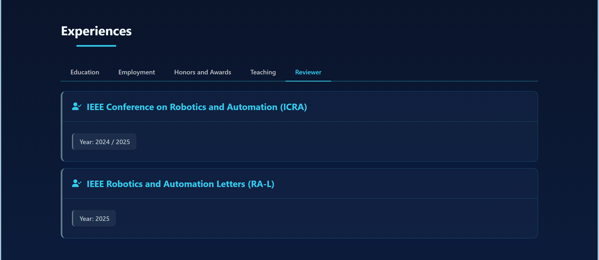


### 添加学术论文

学术论文位于 publications 部分的第一个分栏中。

编辑 `configs/en/papers.json` 以及（或）`configs/zh/papers_zh.json` 文件：
```json
{
  "年份": [
    {
      "title": "论文标题",
      "authors": "作者列表",
      "type": "类型，期刊/会议/在投/研讨会",
      "conference": "会议名称",
      // 以上是以会议举例，如果是期刊，则写为 "journal": "期刊名称",
      "image": "论文配图，存放在images/publication/目录下",
      "paperLink": "论文链接",
      "codeLink": "代码仓库链接，如果无，则可以删除此行",
      "videoLink": "嵌入的视频链接，如果无，则可以删除此行",
      "siteLink": "定制的项目浏览页链接，如果无，则可以删除此行"
    },
    // 如果本年有其他论文，可以在此继续添加...
  ],
  // 如果其他年份有论文，可以在此继续添加...
}
```

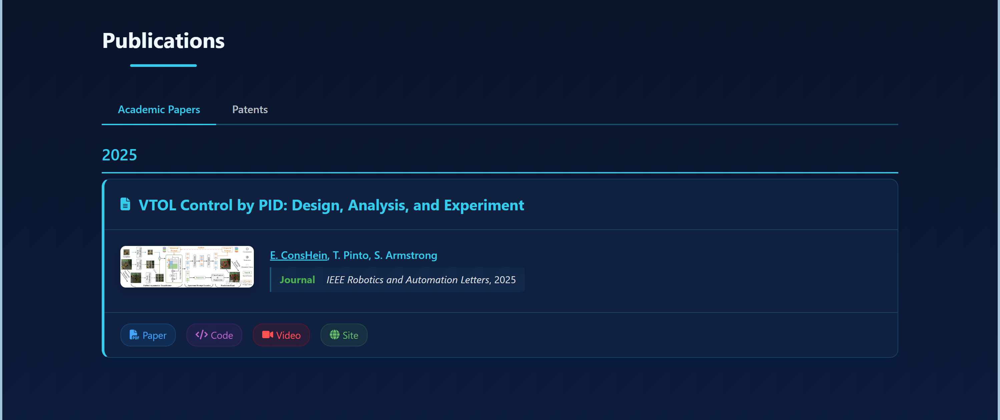


### 添加专利

专利位于 publications 部分的第二个分栏中。如果没有专利相关的信息，那就将文档空置，或者删除文档，对应的栏目将会隐藏。

编辑 `configs/en/patents.json` 以及（或）`configs/zh/patents_zh.json`文件：
```json
{
  "patents": [
    {
        "type": "专利类型",
        "title": "专利标题",
        "authors": "作者列表",
        "number": "专利号",
        "date": "授权日期",
        "link": "专利链接"
    },
    // 如果有更多专利，可以在此继续添加...
  ]
}
```


### 添加最新动态

最新动态位于 home 部分右侧的第二栏中。

编辑 `configs/en/news.json` 以及（或）`configs/zh/news_zh.json`文件：
```json
{
  "news": [
    {
        "time": "动态时间，eg. 2023-01-01",
        "content": "动态内容"
    },
    // 如果有更多动态，可以在此继续添加...
  ]
}
```

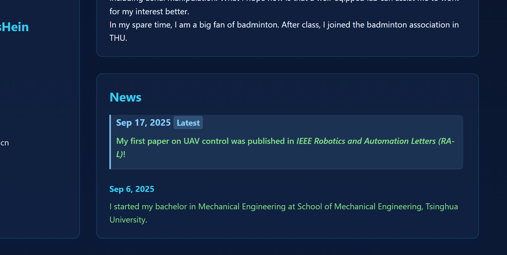


### 添加简历

简历以 PDF Viewer 的方式放在 cv 部分中。

将你的简历 PDF 文件命名为 `cv.pdf`（英文版）以及（或）`cv_zh.pdf`（中文版），替换 `configs/en/cv.pdf` 以及（或）`configs/zh/cv_zh.pdf` 文件。


### 添加个人介绍

个人介绍位于 home 部分右侧的第一栏中。

编辑 `configs/en/intro.txt` 以及（或）`configs/zh/intro_zh.txt`文件，添加你的个人介绍文本。

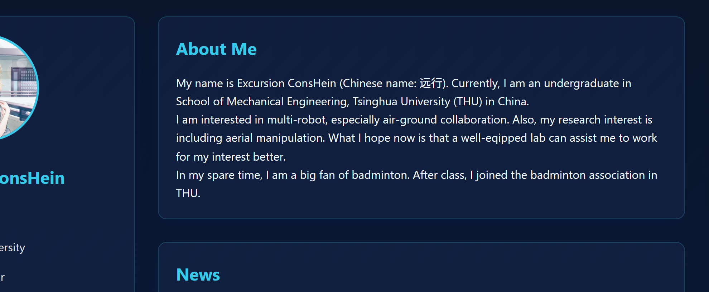

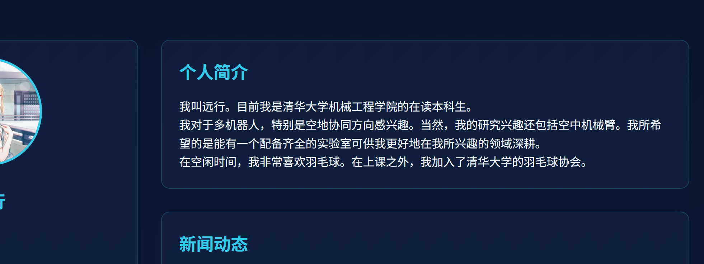

## 5. 添加图片

### 个人照片

个人照片放在 home 部分左侧信息栏的最上方。

将你的个人照片替换 `images/homepage/photo/photo.png` 文件。

### 信息图标

信息图标用于 home 部分左侧信息栏中的类型标识。

你可以替换 `images/homepage/info icon/` 目录下的图片，自定义信息图标。 

### 清理资源

你可以删除 `images/preview` 文件夹，以及清空两个 README.md 文件，减少提交时的文件大小，防止推送阻塞。

## 6. 预览和部署

### 本地预览

1. 在本地计算机上打开 `index.html` 文件即可预览你的个人主页
2. 对于更高级的预览，可以使用本地服务器，例如使用 Python 的简单 HTTP 服务器：
   ```bash
   cd 你的仓库目录
   python -m http.server
   ```
3. 然后在浏览器中访问 `http://localhost:8000`

### 部署到 GitHub Pages

1. 确保你的仓库名称格式为 `你的用户名.github.io`
2. 将所有修改提交并推送到 GitHub：
   ```bash
   git add .
   git commit -m "更新个人信息"
   git push origin main
   ```
3. 等待几分钟，然后访问 `https://你的用户名.github.io` 查看你的个人主页

## 7. 常见问题

### Q: 我需要懂编程吗？
A: 不需要。你只需要按照本教程修改配置文件和添加图片即可。

### Q: 如何自定义页面样式？
A: 如果你有 HTML/CSS 基础，可以修改 `index.html` 文件中的样式。

### Q: 我的主页什么时候会更新？
A: 当你将修改推送到 GitHub 后，通常会在几分钟内更新。

## 8. 联系我们

如果你在使用过程中遇到问题，可以通过以下方式联系我们：
- Email: Conshein_Yuanxing@outlook.com
- GitHub: [Excursion-ConsHein](https://github.com/Excursion-ConsHein)

希望你可以在 **Excursion ConsHein Homepage** 中畅快搭建起属于自己的个人主页！